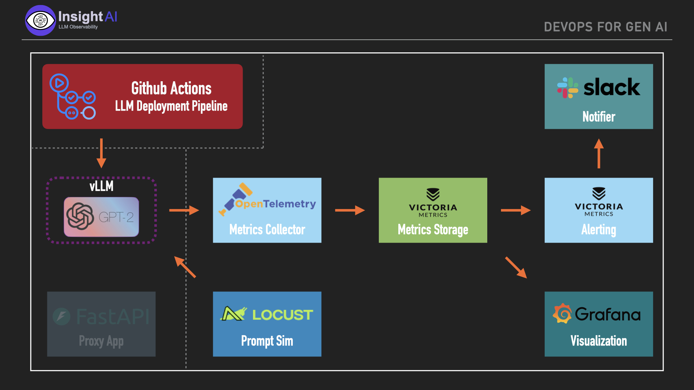

# InsightAI_Minions


Get insight into key KPIs for any LLM that you want to deploy.

This app will deploy the LLM via DevOps operation (Gitbhub Actions for now),
and simulate test prompts (randomly selected from a pre-defined list of 50k
prompts) to measure key KPIs such as latency, token throughput, and number of
successful requests. Metrics are collected (OTEL) and stored (VictoriaMetrics
time series) and then visualized via Grafana.

Value add: in contrast to other solutions in the space we add advanced alerts
(warning and critical, also implemented with VictoriaMetrics) which create
Slack notifications (can be configured for email or other channels later).
Metrics available in Grafana also allow to create other user defined KPIs
(depending on context that the user is interested in).

Group Name: **Minions**

Main Participant Name: **Denis Shleifman**

Team Participant Names: 
* Morteza Mirzaei
* Dorian Gerdes
* Manav Isrrani
* Sachin Kumar

-----------------------------------------------------

## Github Actions

* Pipeline is located in .github/workflows/redeploy.yaml
* When a change is made in the repo the pipeline will redeploy the llm defined ./lab/docker-compose-llm.yaml file
* This can be manually achieved:

```
docker compose -f docker-compose-llm.yaml up -d --build
```


## Observability

* The observabilility should be run on a separate device so that it does not interfere with any collected metrics
* Deployment is defined in ./lab/docker-compose.yaml
To deploy:
```
docker compose -f docker-compose.yaml up -d --build
```

## Architecture

